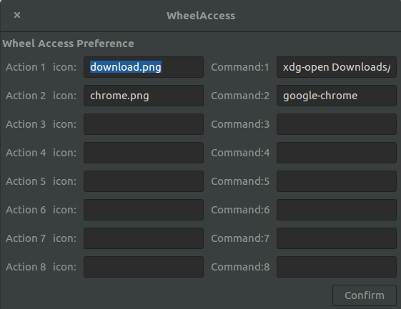
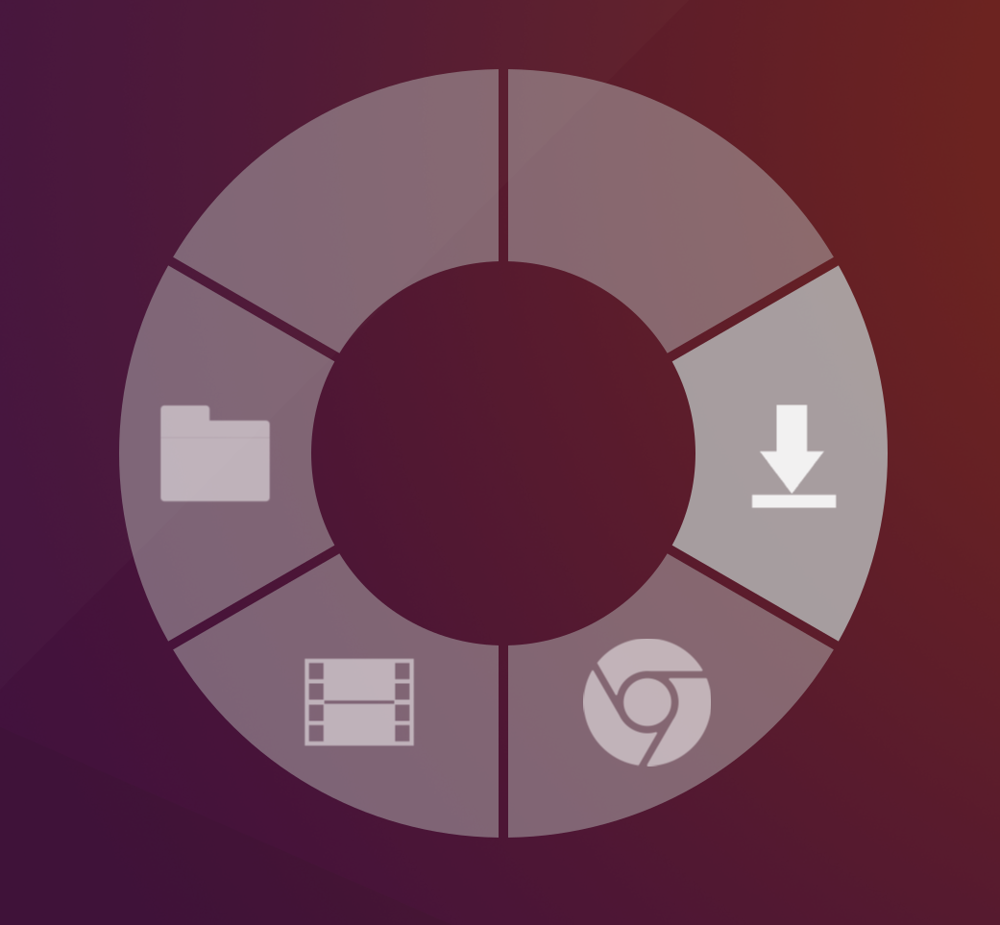

Wheel Access displays a quick-access "wheel" on screen to execute arbitrary
command. Copyright (C) 2018 Fanbo Xiang

# Requirements
- Gnome Shell 3.18 (the application is only tested on version 3.18, it may work
  on other version as well. Bug reports are welcome)

# Install
clone the repo to the installation directory of gnome extensions. On Ubuntu, it
is something like `$HOME/.local/share/gnome-shell/extensions/`.
```sh
cd $HOME/.local/share/gnome-shell/extensions/
git clone https://github.com/fbxiang/WheelAccess.git
```
(You may also need to rename the repository to its uuid by `mv WheelAccess wheelaccess@fbxiang.outlook.com`)

Restart the desktop environment by re-login or press `alt-f2`, `r`, `enter`.

Enable the extension by `gnome-tweak-tool`. You will see an icon displayed on
the topbar (unless the "top" bar is relocated).

# Configure
Click the icon to open preferences menu. It can also be accessed by
`gnome-shell-extension-prefs` command or the gnome web browser plugin.



The icon string should be a path of an image. If a relative position is
provided, the extension will search icons in the path
`/path/to/extension/icons/`. Or an absolute path can be used directly.

The command string should be a shell command that will be executed.

The shortcut key is bound to `Super+w`. The extension looks for the release time
of the `Super` key so the shortcut should be changed.

Type in some icons and commands and enjoy.




If you encountered any system breaking bugs, `ctrl+alt+f1` should still be available...
